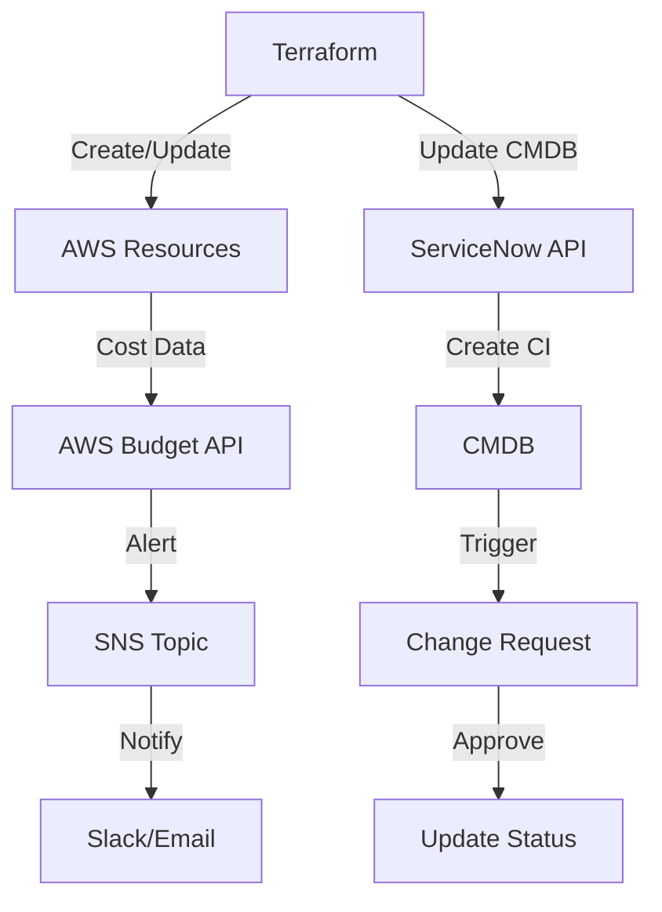

---

# Enterprise Terraform: Automating ServiceNow CMDB & AWS Budget Alerts

Aprende a integrar Terraform con la API de ServiceNow para la automatización de CMDB y alertas de presupuesto de AWS.

## Metadata

**Keywords:** terraform servicenow integration, aws budget alerts terraform, finops automation

## The Enterprise Infrastructure Challenge

Gestionar la infraestructura empresarial manualmente conduce a:
- Registros de CMDB desactualizados que causan retrasos en la respuesta a incidentes
- Costos inesperados de la nube que superan los presupuestos entre un 40-200%
- Violaciones de cumplimiento por recursos no rastreados
- Proliferación de IT en la sombra

Vamos a resolver estos problemas con la automatización de Terraform.

## Architecture Overview



## Terraform Configuration

### Provider Setup

```hcl
terraform {
  required_providers {
    aws = {
      source = "hashicorp/aws"
      version = "~> 4.0"
    }
    servicenow = {
      source = "tylerhatton/servicenow"
      version = "~> 1.0"
    }
  }
}

provider "aws" {
  region = var.AWS_REGION
}

provider "servicenow" {
  instance_url = var.SNOW_INSTANCE
  username = var.SNOW_USERNAME
  password = var.SNOW_PASSWORD
}
```

### ServiceNow CMDB Integration

#### Create AWS Resources

```hcl
resource "aws_instance" "app_server" {
  ami           = var.AMI_ID
  instance_type = "t3.micro"

  tags = {
    Name        = "AppServer"
    Environment = var.ENVIRONMENT
    CostCenter  = var.COST_CENTER
  }
}
```

#### Update ServiceNow CMDB

```hcl
resource "servicenow_cmdb_ci" "app_server" {
  name = aws_instance.app_server.tags.Name
  ip_address = aws_instance.app_server.private_ip
  environment = aws_instance.app_server.tags.Environment
  cost_center = aws_instance.app_server.tags.CostCenter
}
```

---
