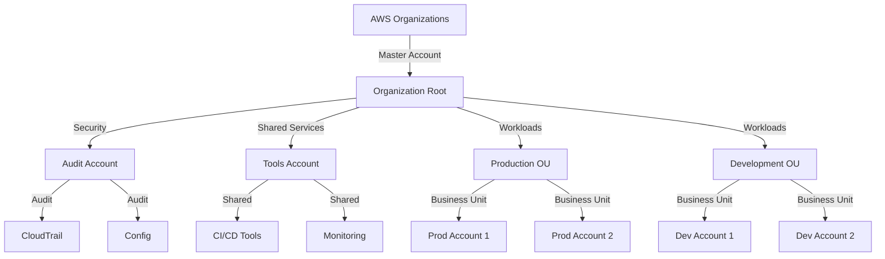

# AWS Enterprise Migration: Battle-Tested Patterns for Multi-Account Success (Complete 2024 Guide)

Master enterprise-grade AWS migrations with proven patterns from $100M+ cloud projects.

## Metadata

**Keywords:** aws enterprise migration, aws multi account setup, aws landing zones, aws organizations

## The Enterprise Migration Challenge

Large-scale AWS migrations often fail due to:
- Uncontrolled cloud sprawl across business units
- Security gaps from inconsistent account baselines
- Cost overruns from unoptimized resource provisioning
- Compliance violations in regulated industries

Let's solve these with battle-tested patterns.

## Enterprise Architecture Overview



## Landing Zone Automation

### AWS Organizations Setup

```python
# organizations_setup.py

import boto3
import logging
from botocore.exceptions import ClientError

class AWSLandingZone:
    def __init__(self):
        self.org_client = boto3.client('organizations')
        self.sts_client = boto3.client('sts')

    def create_organizational_units(self):
        try:
            root_id = self.org_client.list_roots()['Roots'][0]['Id']

            # Create main OUs
            production_ou = self.org_client.create_organizational_unit(
                ParentId=root_id,
                Name='Production'
            )

            development_ou = self.org_client.create_organizational_unit(
                ParentId=root_id,
                Name='Development'
            )

            shared_services_ou = self.org_client.create_organizational_unit(
                ParentId=root_id,
                Name='Shared-Services'
            )

            return {
                'production_ou': production_ou['OrganizationalUnit']['Id'],
                'development_ou': development_ou['OrganizationalUnit']['Id'],
                'shared_services_ou': shared_services_ou['OrganizationalUnit']['Id']
            }
        except ClientError as e:
            logging.error(e)
            return None
